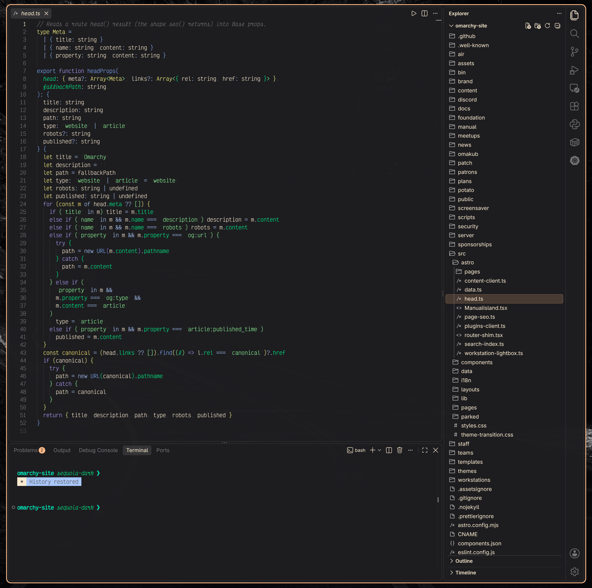

# Sequoia Dark Theme

A matching VS Code theme for my Omarchy Sequoia Dark aesthetic.

```
Name: Sequoia Dark
Id: AlexGrigore.sequoia-dark
Description: A dark VS Code theme with warm amber, neon green, blue and purple accents that matches the Sequoia Dark Omarchy theme.
Version: 1.0.0
Publisher: AlexGrigore
```

## Installation

Launch VS Code Quick Open (Ctrl+P), paste the following command, and press enter.

```text
ext install AlexGrigore.sequoia-dark
```

## Preview


